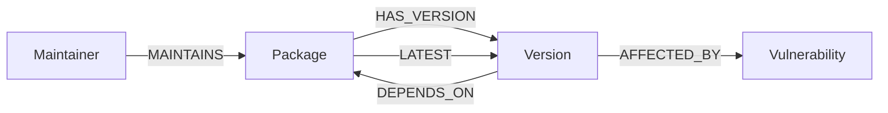

# NPM Blast Radius Explorer

**🚀 Live Demo:** [https://wexa-ai-assignment-nine.vercel.app/](https://wexa-ai-assignment-nine.vercel.app/)
> **A graph-powered npm dependency analysis tool** — built on [CognoDB](https://console.cognodb.com) (openCypher over Bolt) with Next.js, TypeScript, and react-force-graph-2d.


---

## Why a graph database?

Dependency resolution is inherently **recursive many-to-many**. Each npm version depends on version ranges of other packages, which depend on others, arbitrarily deep.

| Question | SQL approach | Graph (Cypher) approach |
|---|---|---|
| "All transitive deps of X, 4 hops deep" | Recursive CTE or repeated self-joins — slow, verbose | `MATCH ()-[:DEPENDS_ON*1..4]->()` — single native traversal |
| "Which root apps are affected by a vuln in package Y?" | Extremely complex recursive CTE with multiple intermediate tables | `MATCH path = (root)-[:HAS_VERSION]->()-[:DEPENDS_ON*1..6]->(target)` |
| "Shortest path A → B" | Not supported natively — requires application-level BFS | `shortestPath((a)-[*..12]-(b))` — built-in |
| "Which package has most transitive dependents?" (centrality) | Recursive aggregate — O(n²) in worst case | Single traversal count with native indexing |

A relational schema would require repeated self-joins or recursive CTEs past 3 hops, getting exponentially slower. In CognoDB, these are **native, indexable graph operations**.

---

## Data Model



### Nodes

| Label | Key Properties |
|---|---|
| `Package` | `name`, `description`, `homepage` |
| `Version` | `version`, `publishedAt`, `deprecated`, `packageName` |
| `Vulnerability` | `id`, `severity`, `summary`, `cveId` |
| `Maintainer` | `username` |

### Relationships

| Relationship | From → To | Properties |
|---|---|---|
| `HAS_VERSION` | Package → Version | — |
| `LATEST` | Package → Version | — (fast lookup shortcut) |
| `DEPENDS_ON` | Version → Package | `versionRange`, `type` (dependency \| devDependency \| peerDependency) |
| `AFFECTED_BY` | Version → Vulnerability | — |
| `MAINTAINS` | Maintainer → Package | — |

---

## Core Cypher Queries

### 1. Multi-hop dependency traversal
```cypher
MATCH (root:Package {name: $name})-[:HAS_VERSION]->(rv:Version)
WITH root, rv ORDER BY rv.publishedAt DESC LIMIT 1
MATCH path = (rv)-[:DEPENDS_ON*0..4]->(dep:Package)-[:HAS_VERSION]->(dv:Version)
RETURN DISTINCT dep.name, dv.version, dv.deprecated
ORDER BY dep.name
```

### 2. Blast radius — all root packages affected by a compromise (the "relational-awkward" query)
```cypher
MATCH path = (root:Package)-[:HAS_VERSION]->(:Version)-[:DEPENDS_ON*1..6]->(target:Package {name: $name})
OPTIONAL MATCH (target)-[:HAS_VERSION]->(:Version)-[:AFFECTED_BY]->(vuln:Vulnerability)
RETURN DISTINCT root.name, length(path), [n IN nodes(path) WHERE n:Package | n.name], vuln
ORDER BY length(path) ASC
```

### 3. Shortest path between two packages
```cypher
MATCH (a:Package {name: $from}), (b:Package {name: $to})
MATCH path = shortestPath((a)-[:HAS_VERSION|DEPENDS_ON*..12]-(b))
RETURN [n IN nodes(path) WHERE n:Package | n.name], length(path)
LIMIT 1
```

### 4. Centrality-ish risk ranking (riskiest packages — no clean SQL equivalent)
```cypher
MATCH (dep:Package)<-[:DEPENDS_ON]-(:Version)<-[:HAS_VERSION]-(dependant:Package)
WITH dep, count(DISTINCT dependant) AS dependantCount
OPTIONAL MATCH (dep)-[:HAS_VERSION]->(:Version)-[:AFFECTED_BY]->(v:Vulnerability)
RETURN dep.name, dependantCount, collect(DISTINCT v) AS vulns
ORDER BY dependantCount DESC
LIMIT $limit
```

### 5. Shared dependency finder between two packages
```cypher
MATCH (a:Package {name: $pkgA})-[:HAS_VERSION]->(av:Version)-[:DEPENDS_ON*1..4]->(shared:Package)
MATCH (b:Package {name: $pkgB})-[:HAS_VERSION]->(bv:Version)-[:DEPENDS_ON*1..4]->(shared)
RETURN DISTINCT shared.name, av.version AS leftVer, bv.version AS rightVer,
       leftVer <> rightVer AS hasConflict
ORDER BY shared.name
```

> **All queries are fully parameterised** via the official `neo4j-driver` — no string concatenation in Cypher.

---

## Application Screens

| Screen | URL | What it does |
|---|---|---|
| Search / Home | `/` | Search packages, see quick-action buttons |
| Dependency Explorer | `/explore` | Interactive force-directed dependency graph |
| Blast Radius | `/blast-radius` | Finds every root app affected by a vulnerable package |
| Compare | `/compare` | Shared deps + version conflicts between two packages |
| Risk Ranking | `/risk` | Centrality-based "riskiest package" ranking |

---

## Project Structure

```
npm-blast-radius/
├── src/
│   ├── app/
│   │   ├── api/
│   │   │   ├── packages/route.ts        # Search + package info
│   │   │   ├── dependencies/route.ts    # Multi-hop traversal
│   │   │   ├── blast-radius/route.ts    # Blast radius query
│   │   │   ├── shortest-path/route.ts   # Shortest path
│   │   │   ├── risk-ranking/route.ts    # Centrality ranking
│   │   │   └── compare/route.ts         # Shared dependencies
│   │   ├── explore/page.tsx
│   │   ├── blast-radius/page.tsx
│   │   ├── compare/page.tsx
│   │   ├── risk/page.tsx
│   │   ├── layout.tsx
│   │   ├── page.tsx
│   │   └── globals.css
│   ├── components/
│   │   ├── DependencyGraph.tsx  # Force-directed graph (react-force-graph-2d)
│   │   ├── ErrorBanner.tsx      # Graceful DB error display
│   │   ├── LoadingStates.tsx    # Spinner, skeleton, page loader
│   │   └── Navbar.tsx           # Sticky navigation
│   └── lib/
│       ├── db.ts                # Singleton Neo4j driver + AppError
│       └── queries.ts           # All Cypher queries
├── scripts/
│   └── seed.ts                  # One-shot idempotent seed script
├── .env.example                 # Template — copy to .env.local
└── next.config.ts
```

---

## Setup

### 1. Create a CognoDB instance

1. Go to [console.cognodb.com](https://console.cognodb.com/signup) and sign up (no credit card)
2. Create a free **c0** instance, pick a region
3. Copy your connection URI (`bolt+s://<instance-id>.databases.cognodb.cloud`) and password

### 2. Configure environment

```bash
cp .env.example .env.local
# Edit .env.local with your CognoDB credentials
```

```env
COGNODB_URI=bolt+s://<instance-id>.databases.cognodb.cloud
COGNODB_USER=cognodb
COGNODB_PASSWORD=your_password_here
```

### 3. Install and seed

```bash
npm install
npm run seed      # Crawls npm registry + writes to CognoDB (~2 min)
```

The seed script:
- Crawls 8 root packages (express, next, react, axios, lodash, webpack, fastify, koa) from the real npm registry API
- Builds the graph in memory, then writes via parameterised `UNWIND + MERGE` batches
- Is **idempotent** — safe to re-run
- Attaches 5 synthetic vulnerabilities to mid-tree packages for blast-radius demo

### 4. Run locally

```bash
npm run dev
# Open http://localhost:3000
```

---

## Deploy to Vercel

```bash
npx vercel --prod
```

Set the same 3 environment variables in the Vercel dashboard:
- `COGNODB_URI`
- `COGNODB_USER`  
- `COGNODB_PASSWORD`

> Keep your CognoDB instance running — the free c0 tier persists data but the instance must be active for the app to query it.

---

## Engineering Notes

- **`lib/db.ts`**: Singleton driver with `try/catch` on every query, converting driver errors to `AppError` with a `code` field. Every API route catches `AppError` and returns appropriate HTTP status codes.
- **Parameterised queries only**: All Cypher uses `$paramName` syntax via the driver — zero string concatenation.
- **`serverExternalPackages: ["neo4j-driver"]`**: Ensures the neo4j driver (which uses Node.js built-ins) stays server-side only.
- **SSR-safe graph**: `react-force-graph-2d` is loaded via `dynamic(() => import(...), { ssr: false })` to avoid canvas issues.
- **Loading/empty/error states**: Every page has a `PageLoader` fallback, an `ErrorBanner` for DB issues, and an empty-state for zero results.

---

